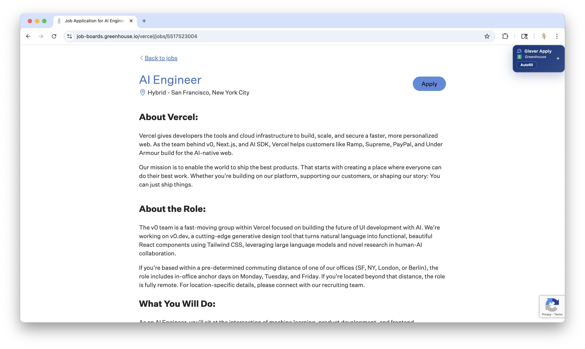
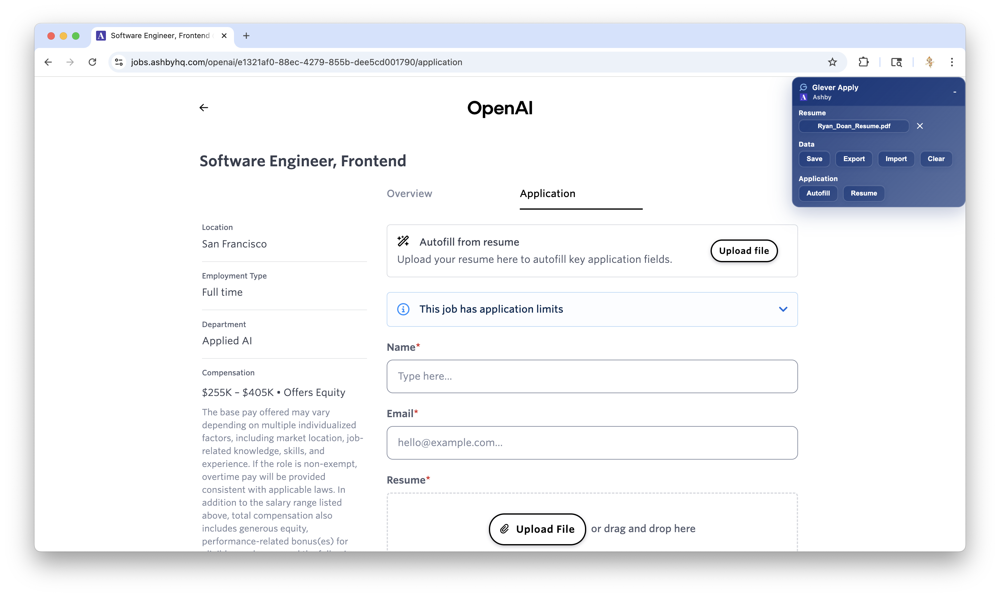

# Glever Apply — Job Application Autofill

Glever Apply is a Chrome extension that autofills job applications on Greenhouse, Lever, Ashby, Workable, and Rippling. It remembers answers per application and builds a reusable bank of responses over time, so you spend less time typing and more time applying.

[Watch the full demo (MP4)](assets/GleverApply.mp4)

It pairs well with https://glever.co/, a job board that sources roles directly from Greenhouse, Lever, Ashby, Workable, and Rippling. Discover openings on Glever.co and use Glever Apply to quickly autofill when you click through to apply on the ATS.

## Supported Platforms

- Greenhouse
- Lever
- Ashby
- Workable
- Rippling

## Quick Autofill

Autofill your application with a minimal UI that stays out of your way. One click to fill common fields, tailored to each ATS.

## Autofill Expanded

Open the expanded view to manage your data and control autofill behavior. Import, export, clear, or save your job application data for future use across compatible ATS sites.

## How It Works

- Saves answers per application: Builds a growing bank of responses as you apply.
- Context-aware autofill: Maps your saved answers to each platform’s fields.
- Light footprint: Quick Autofill provides a minimal, on-page UI; Expanded view gives full control when you need it.

## Installation

1. Open Chrome and go to `chrome://extensions`.
2. Enable Developer Mode (top-right toggle).
3. Click “Load unpacked” and select the project’s `dist` or project root (depending on your build).
4. Navigate to a supported ATS application page to see the Quick Autofill UI.

## Tips

- Use Quick Autofill for fast, minimal UI filling.
- Switch to Expanded to import/export, clear, or save your data for reuse.
- As you answer new questions, Glever Apply saves them to improve future autofill.

## Privacy

- Your data stays on your device unless you choose to export it.
- You control what gets saved, imported, or cleared from the Expanded view.
